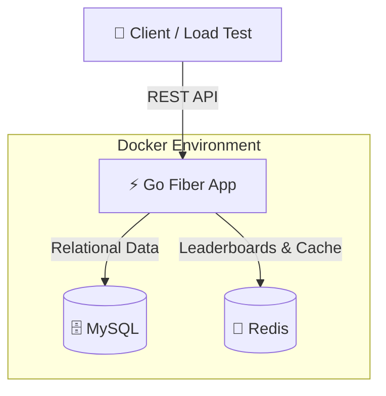

# ⚡ BrainBolt

[](https://go.dev/)
[](https://www.docker.com/)
[](https://www.mysql.com/)
[](https://redis.io/)

BrainBolt is a high-performance, containerized quiz game backend designed for ultra-low latency and high concurrency. Built with **Go (Fiber)**, **MySQL**, and **Redis**, it features real-time leaderboards, question tracking, and robust rate limiting.

---

## 🏗 Architecture



---

## 🚀 Key Features

*   **⚡ Ultra-Fast API**: Built on the Fiber framework for minimal overhead.
*   **📊 Real-time Leaderboards**: Powered by Redis Sorted Sets for instant `O(log(N))` updates and retrieval.
*   **🧠 Intelligent Quiz Engine**: Tracks user progress and ensures variety in question delivery.
*   **🛡️ Built-in Rate Limiting**: Per-user rate limiting to prevent abuse and ensure fair play.
*   **🐳 One-Command Setup**: Fully containerized environment with automated database seeding.
*   **📈 Integrated Load Testing**: Custom shell-based load tester to measure `time_starttransfer` (server processing time).

---

## 🏁 Getting Started

### Prerequisites

*   [Docker Desktop](https://www.docker.com/products/docker-desktop/)
*   [curl](https://curl.se/) & [jq](https://jqlang.github.io/jq/) (for testing)

### Launching the Stack

Fire up the entire infrastructure with a single command:

```bash
docker-compose up --build
```

**Services will be available at:**
*   **API Gateway**: `http://localhost:3001`
*   **MySQL DB**: `localhost:3307` (user: `root`, pass: `root`)
*   **Redis**: `localhost:6380`

---

## 🧪 Testing & Validation

### 1. Functional API Tests
Verify all endpoints (next question, answer submission, leaderboard, metrics) are working correctly:

```bash
./scripts/test_api.sh
```

### 2. High-Concurrency Load Test
Simulate real-world traffic to measure performance and latency:

```bash
# Run with 10 concurrent users for 60 seconds (Default)
./scripts/loadtest.sh

# Stress test: 50 concurrent users for 300 seconds
./scripts/loadtest.sh 50 300
```

> **Note:** Results are auto-generated in the `loadtest_results/` directory, including p50, p95, and p99 latency percentiles.

---

## 📂 Project Structure

```text
├── cmd/brainbolt/      # Application entry point
├── internal/           # Core business logic
│   ├── handlers/       # HTTP request handlers
│   ├── service/        # Domain services
│   ├── repository/     # Data access layer (MySQL/Redis)
│   └── database/       # DB initialization
├── scripts/            # Utility & performance test scripts
├── loadtest_results/   # Generated performance reports
└── docker-compose.yml  # Infrastructure orchestration
```

---

## ⚙️ Configuration

Environment variables can be adjusted in `docker-compose.yml` for the application, or `scripts/loadtest_config.env` for the load test runner.

**Database Connectivity (Docker):**
```bash
mysql -h 127.0.0.1 -P 3307 -u root -proot brainbolt
```

---

<p align="center">
  Developed with ❤️ by the BrainBolt Team
</p>
